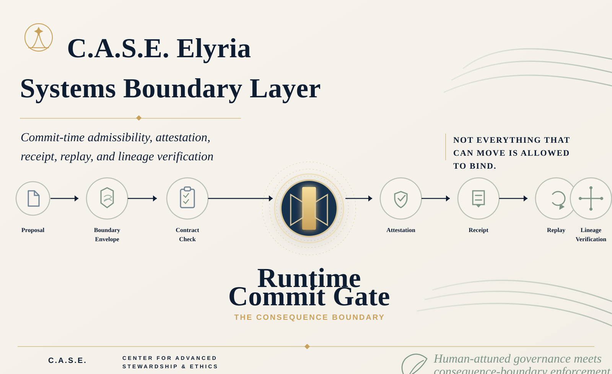

# ✨ C.A.S.E. Elyria Systems Boundary Layer


## Current Classification

**A+ local artifact proof surface.**

This classification is bounded to the claim this repository actually makes.

It is **not** production-certified, third-party certified, universal governance proof, deployed network no-bypass proof, customer-specific corridor certification, or protected kernel disclosure.

## Reviewer Summary

C.A.S.E. Elyria Systems Boundary Layer is a public-safe local artifact proof surface for proposed effect-bearing movement.

The repo does not merely show a runtime gate.

It shows a preserved release package where a proposed movement enters a boundary envelope, standing is re-bound, admissibility is checked, commit authority is attested, receipts are emitted, replay compares governing conditions, and lineage verification breaks on tamper.

Core invariant:

**Proposed movement enters.  
Boundary resolves.  
No protected consequence binds without the boundary result.**

<p align="center">
  
</p>

<p align="center"><em>Approval is not enough. Standing must be re-bound at commit.</em></p>

## A+ Local Artifact Reviewer Path

Run:

```bash
npm install
npm run verify
```

Expected:

```text
RESULT: C.A.S.E. BOUNDARY PASS
```

Tamper test:

```bash
node -e "const fs=require('fs'); const p='release/case_v22_rerun_clean_release/contracts/deployment_profile.json'; fs.appendFileSync(p, '\n')"
npm run verify
```

Expected:

```text
RESULT: C.A.S.E. BOUNDARY FAIL
```

Restore:

```bash
git checkout -- release/case_v22_rerun_clean_release/
npm run verify
```

Expected:

```text
RESULT: C.A.S.E. BOUNDARY PASS
```

Executable tamper check:

```bash
npm run tamper:test
```

This is a local artifact proof surface. It does not claim production certification, third-party certification, universal governance proof, deployed network no-bypass enforcement, or protected kernel disclosure.

Python verifier path:

```bash
python external-verifier/verify_a_plus_bundle.py
pytest
```

<p align="center">
  
  
  
</p>

<p align="center">
  
  
  
</p>

> **🧭 Governing principle:** Not everything that can move is allowed to bind.

---

## Buyer review path

Start here:

- [`A_PLUS_CLASSIFICATION.md`](A_PLUS_CLASSIFICATION.md)
- [`A_PLUS_REVIEW_EVIDENCE.md`](A_PLUS_REVIEW_EVIDENCE.md)
- [`EXECUTIVE_SUMMARY.md`](EXECUTIVE_SUMMARY.md)
- [`BUYER_REVIEW_GUIDE.md`](BUYER_REVIEW_GUIDE.md)
- [`CLAIM_BOUNDARY.md`](CLAIM_BOUNDARY.md)
- [`PILOT_LANE.md`](PILOT_LANE.md)
- [`COMMERCIAL_BOUNDARY.md`](COMMERCIAL_BOUNDARY.md)
- [`SECURITY_POSTURE.md`](SECURITY_POSTURE.md)
- [`PROOF_SURFACE.md`](PROOF_SURFACE.md)
- [`PROOF_RESULTS.md`](PROOF_RESULTS.md)
- [`external-verifier/verify_a_plus_bundle.py`](external-verifier/verify_a_plus_bundle.py)
- [`external-verifier/verify_digest_manifest.py`](external-verifier/verify_digest_manifest.py)
- [`tests/test_external_verifier.py`](tests/test_external_verifier.py)
- [`docs/NO_BIND_PROOF_TRANSCRIPT.md`](docs/NO_BIND_PROOF_TRANSCRIPT.md)
- [`docs/ROUTE_CLOSURE_PROOF.md`](docs/ROUTE_CLOSURE_PROOF.md)
- [`docs/CHANGED_CONDITION_REPLAY_TRANSCRIPT.md`](docs/CHANGED_CONDITION_REPLAY_TRANSCRIPT.md)
- [`docs/TAMPER_TEST.md`](docs/TAMPER_TEST.md)
- [`docs/BENCHMARK_SCORECARD.md`](docs/BENCHMARK_SCORECARD.md)
- [`docs/BUYER_REVIEWER_READOUT.md`](docs/BUYER_REVIEWER_READOUT.md)
- [`docs/FRESH_CLONE_REVIEW_TEST.md`](docs/FRESH_CLONE_REVIEW_TEST.md)
- [`docs/BUYER_DEMO_SCRIPT.md`](docs/BUYER_DEMO_SCRIPT.md)
- [`docs/CASE_ELYRIA_MAPPING.md`](docs/CASE_ELYRIA_MAPPING.md)
- [`docs/BUYER_FAQ.md`](docs/BUYER_FAQ.md)

---

## What this is

**C.A.S.E. v22 Rerun Clean Release** is a pre-formation consequence-boundary proof surface for proposed effect-bearing movement.

It packages the C.A.S.E. layer as a reviewable boundary system:

**📄 Proposal → 🛡️ Boundary Envelope → 📋 Contract Check → ✨ Runtime Commit Gate → 🏅 Attestation → 🧾 Receipt → 🔁 Replay → 🌿 Lineage Verification**

---

## What this repository proves

This package proves the local artifact line represented here:

- proposed effect-bearing movement must enter through a boundary service envelope
- admissibility is resolved at `runtime_commit_gate`
- standing is re-bound before protected consequence may bind and is not inherited
- commit attestation binds governing basis, authority scope, evidence lineage, current state, runtime identity, and contract identity
- failed admission produces refusal / no-bind behavior
- receipts preserve the boundary result
- same-condition replay and changed-condition replay compare governing conditions explicitly
- lineage verification breaks loudly on tamper
- release hashes verify preserved artifacts

---

## Scope Boundary

C.A.S.E. v22 is a bounded proof surface for buyer review.

It demonstrates how proposed movement is checked before protected consequence binds, how standing is re-bound before effect, and how attestation, receipt, replay, and lineage make the result reviewable.

The claim is narrow by design:

**local artifact truth for this C.A.S.E. v22 release package.**

---

## Repository layout

```text
release/case_v22_rerun_clean_release/
  contracts/       authoritative contract identity and deployment profile
  runtime/         boundary service, commit gate, receipt, replay, lineage, proof suite
  ui/              local reviewer interface
  proof/           proof cases and generated proof-suite reports
  gates/           gate output snapshots
  docs/            release documentation and claim-scope material
scripts/
  run-proof-suite.mjs
  verify-release-hashes.mjs
  serve.mjs
  tamper-test.mjs
external-verifier/
  verify_a_plus_bundle.py
  verify_digest_manifest.py
tests/
  test_external_verifier.py
.github/workflows/
  verify.yml
```

The release package is preserved under `release/case_v22_rerun_clean_release/` so the included release manifest and release-hash file remain directly verifiable.

---

## Run locally

```bash
npm run start
```

Then open:

```text
http://localhost:8080/ui/
```

---

## Verify the release

```bash
npm run verify
pytest
npm run tamper:test
```

This runs Node release verification, Node proof execution, Python external verification, pytest coverage for the verifier lane, and executable tamper-fail validation.

- `verify:hashes` validates `RELEASE_HASHES.json` against the preserved release files.
- `proof` executes the C.A.S.E. proof suite, validates boundary documentation, and emits the final boundary result.
- `verify:python` executes `external-verifier/verify_a_plus_bundle.py`.
- `pytest` checks the Python verifier lane.
- `tamper:test` mutates a preserved release artifact, requires verifier failure, restores the artifact, and requires verifier pass.

Expected final passing line:

```text
RESULT: C.A.S.E. BOUNDARY PASS
```

Expected final failing line after tamper or verifier failure:

```text
RESULT: C.A.S.E. BOUNDARY FAIL
```

---

## Commercial boundary

This repository is a review surface, not a commercial deployment license. Commercial pilots require written scope. Customer data cannot be used without agreement. Production deployment requires a separate security and architecture review.

---

## Suggested repository metadata

**Name:** `C.A.S.E.-Elyria-Systems-Boundary-Layer`

**Description:**  
Buyer-reviewable local proof package for C.A.S.E.–Elyria pre-formation consequence-boundary review, commit-time admissibility, attestation, receipt, replay, and lineage verification.

**Topics:**  
`ai-governance`, `runtime-governance`, `admissibility`, `commit-gate`, `replay`, `receipts`, `lineage`, `deterministic-systems`, `ai-safety`, `compliance`
